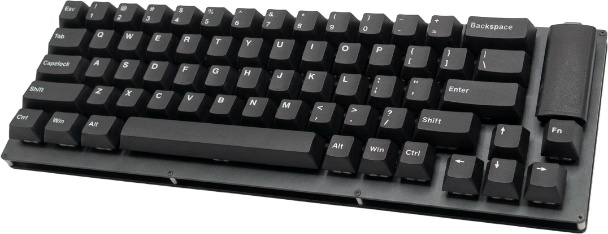
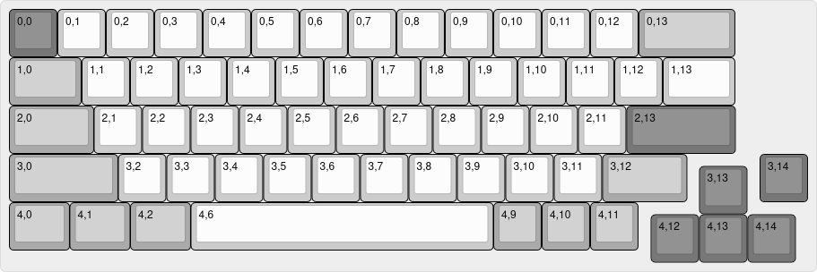
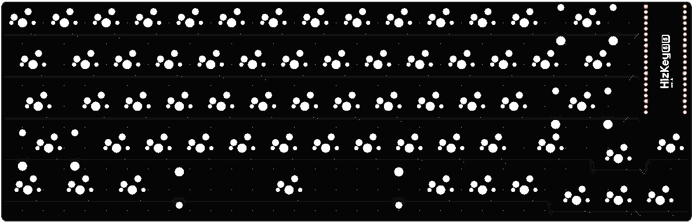
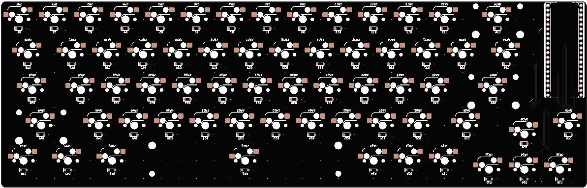
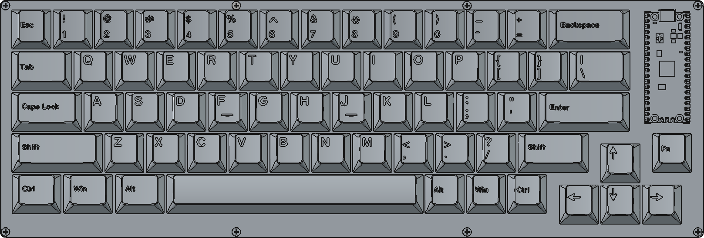
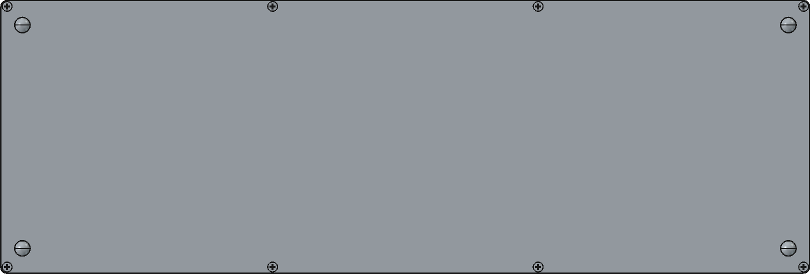
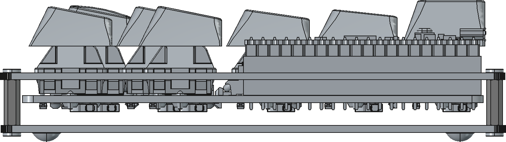

# hzk65

  

<h1></h1>

> Modular assembly 65% keyboard

HizKey65 ([/is̻ki/](https://hiztegiak.elhuyar.eus/eu/hizki)) is a modular assembly 65% keyboard with a socketed controller, hot-swap switch sockets, sandwich-mounted case and ANSI layout.

Built with [KiCad](https://www.kicad.org/) and [FreeCAD](https://www.freecad.org/) and manufactured by [JLC Digital Manufacturing](https://jlcpcb.com/).

> [!NOTE]
> Enclose the controller in an acrylic housing or use conformal coating for enhanced protection

## Latest revisions

- hzk65: for Cherry MX compatible switches

  - Rev. A (Hotswappable)

## Layout

*[KLE layout](https://www.keyboard-layout-editor.com/##@@_c=%23777777%3B&=0,0&_c=%23cccccc%3B&=0,1&=0,2&=0,3&=0,4&=0,5&=0,6&=0,7&=0,8&=0,9&=0,10&=0,11&=0,12&_c=%23aaaaaa&w:2%3B&=0,13%3B&@_w:1.5%3B&=1,0&_c=%23cccccc%3B&=1,1&=1,2&=1,3&=1,4&=1,5&=1,6&=1,7&=1,8&=1,9&=1,10&=1,11&=1,12&_w:1.5%3B&=1,13%3B&@_c=%23aaaaaa&w:1.75%3B&=2,0&_c=%23cccccc%3B&=2,1&=2,2&=2,3&=2,4&=2,5&=2,6&=2,7&=2,8&=2,9&=2,10&=2,11&_c=%23777777&w:2.25%3B&=2,13%3B&@_c=%23aaaaaa&w:2.25%3B&=3,0&_c=%23cccccc%3B&=3,2&=3,3&=3,4&=3,5&=3,6&=3,7&=3,8&=3,9&=3,10&=3,11&_c=%23aaaaaa&w:1.75%3B&=3,12&_x:1.5&c=%23777777%3B&=3,14%3B&@_y:-0.75&x:14.25%3B&=3,13%3B&@_y:-0.25&c=%23aaaaaa&w:1.25%3B&=4,0&_w:1.25%3B&=4,1&_w:1.25%3B&=4,2&_c=%23cccccc&w:6.25&%2F_rs:180%3B&=4,6&_c=%23aaaaaa%3B&=4,9&=4,10&=4,11%3B&@_y:-0.75&x:13.25&c=%23777777%3B&=4,12&=4,13&=4,14)*

## PCB

*Top view*

*Bottom view*

## Assembly

*Top view*

*Bottom view*

*Side view*

## Credits

- [CherryMx](https://github.com/hineybush/CherryMX): MX profile keycap 3D models
